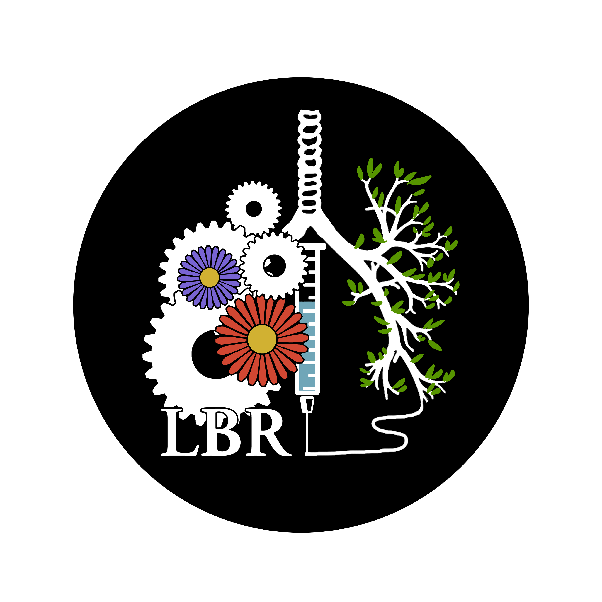

### Sustainability

 

The Lung Bioengineering and Regeneration (LBR) group at Lund University is committed to doing our part to help achieve the Agenda 2030 Sustainability goals set by the United Nations. Our efforts range from improving our work flows and procedures to maximize their efficiency and increase equal access to a diverse work force, as well as reducing our use of consumables and energy and working to replace chemicals which are harmful across their life cycle. Additionally, all members of the LBR group are working continuously to implement concepts of sustainability in their own research projects. In this page you will find examples of the steps LBR has taken towards a more sustainable science. Please come back to this page to follow our journey and learn with us on the way to achieving Agenda 2030.

**Some examples of projects:**

1. Replacing xylene in all aspects of histology.
2. Development of digital work flows, including all standard work routines, to improve equality in the workplace (e.g. rapid access to translation services for those who do not speak Swedish or English, seamless integration with services to help those who are seeing or hearing impaired, etc.)
3. Priority on reducing, replacing and refining animal research (3Rs).
    a. Development of new models to replace animal research: precision cut organ slices from human tissue, 3D bioprinting, and organs on a chip
    b. Techniques to reduce animal numbers if used:
    - live imaging of PCLS
    - techniques to perform next generation sequencing on PCLS (to reduce animal numbers and allow digital data sharing through deposition on public servers)
    - use of 3D printing devices to simultaneously isolate multiple cell types from one mouse
    c. All pilot experiments should use animals in tissue sharing programs
    d. Use of publicly available data sets in early stages of all projects if possible to reduce animal usage

4. Use of electric timers at all work stations to automatically reduce electricity
5. Recycling and repurposing of equipment (including restoration of old scientific equipment)

Check back soon for our protocols! Please be in touch if you want to collaborate on our sustainability work. Contact: darcy.wagner@med.lu.se or individual project leaders as seen on the main page.

